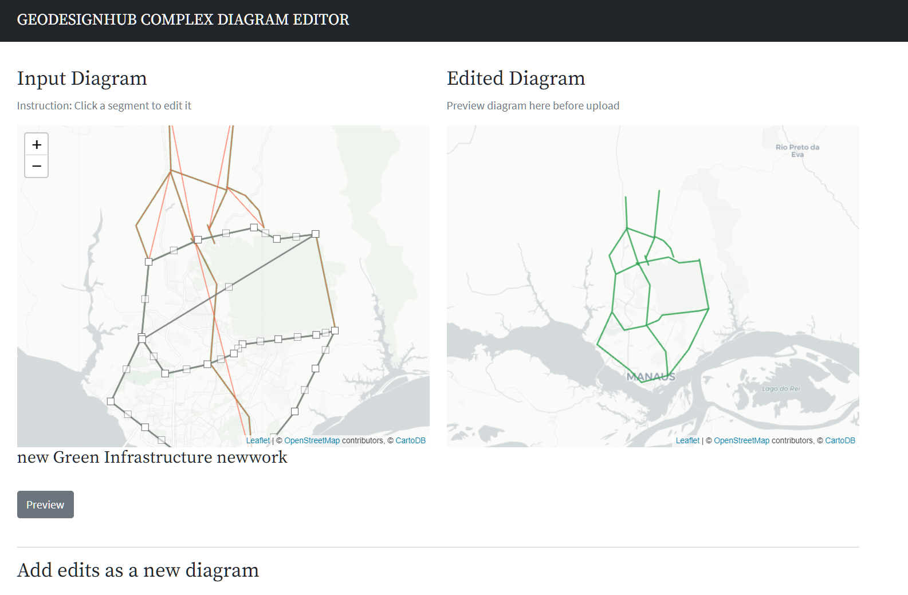
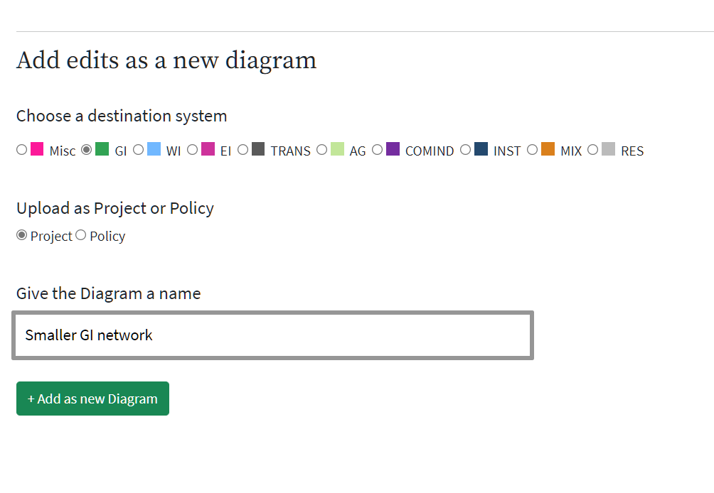

# Complex Diagram Editor

This plugin takes diagram information a project in Geodesignhub using the [Geodesignhub](https://www.geodesignhub.com/). It then provides a way edit them and then upload edited polygon to a different or same system as a new diagram available to be used in a design. This is especially useful when you are working with complex polygons / shapes. These are normally created / generated in GIS systems but are added to a Geodesignhub project. 

## Adding the plugin

This plugin can be added to your project in the Administration panel

## Screenshots

Edit the polygon

Upload new diagram to Geodesignhub

Upload the diagram in a different system

